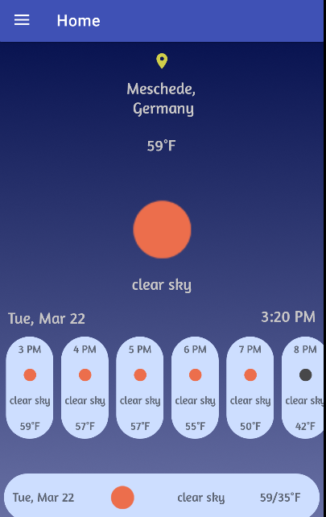
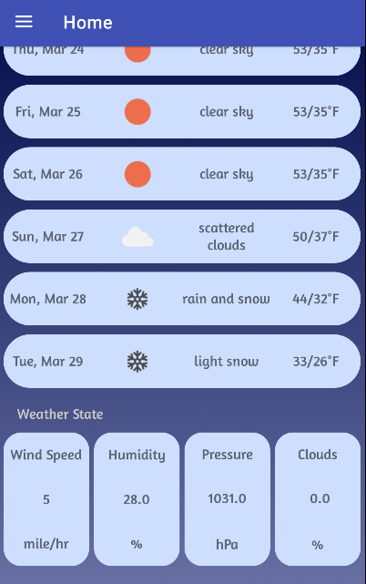
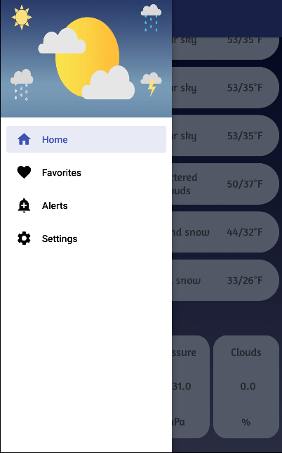
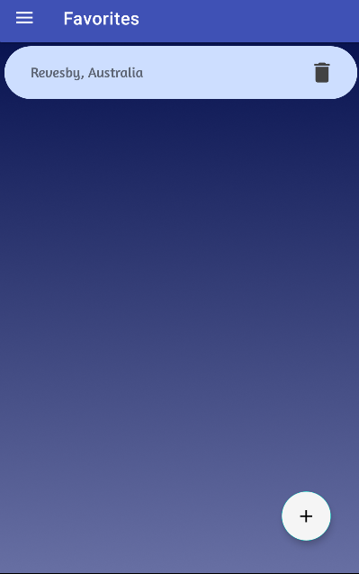
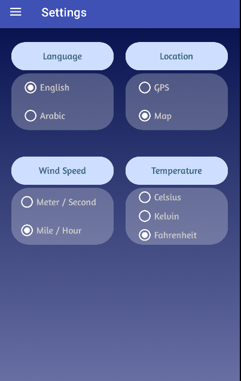
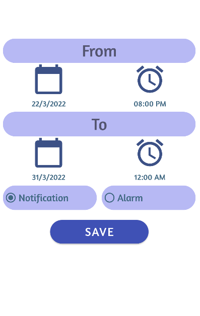
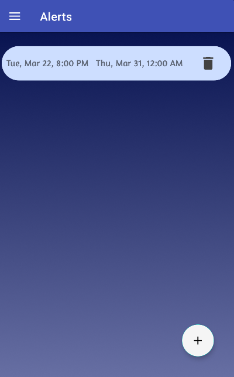

# WeatherApp
 
 
 

An application for weather :

1- User can select his location by mobile location or choose his location from google maps.

2- The application predicts the weather throughout the day and week.

3- User can add favorite places to his favorite list and get the forecast for these places.

4- User can add alerts for any weather alert come from API.

5- User can select language from Arabic and English.

6- User can change the temperature and wind speed units.

# Application architecture and structure

It is a single module project architecture. And, I'm following the Clean Architecture as a Software Architecture Pattern and MVVM as a Presentation Layer Pattern.

# Third-party used

1- ROOM : for chasing data.

2- Coroutines : for handling the background operations.

3- Glide : for presenting images.

4- Retrofit : for making calls from API.

5- WorkManager : for scheduling background services and broadcast.

6- Navigation.

# API Services 
 Weather API
 
 https://openweathermap.org/api
